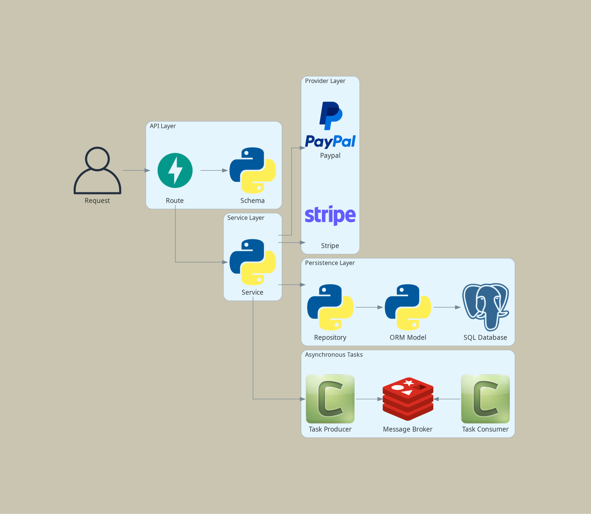
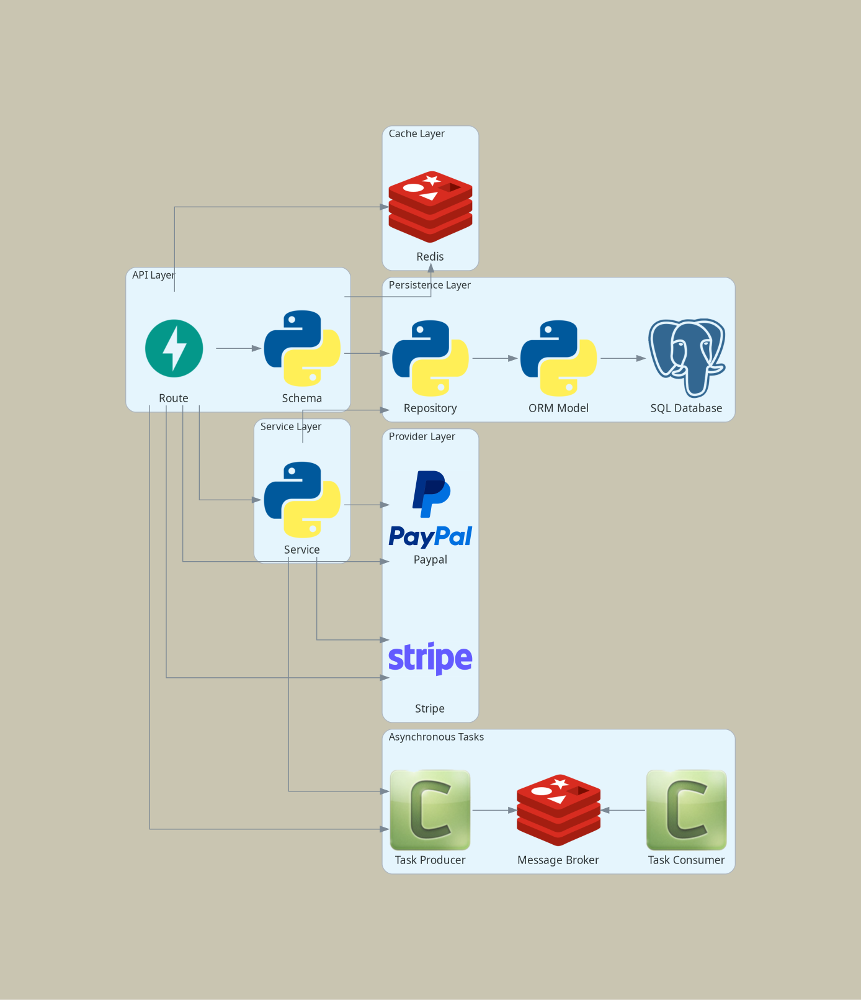

# Cinebooker
CineBooker is a cinema ticketing app for browsing movies, reserving seats, paying via PayPal or Stripe, applying discounts, and getting PDF invoices stored in AWS.

---

## Application Layer Components

The application follows some of the ideas of Domain Driven Design arquitecture:

1. **Schema**: Converts data structures (often Python objects) to formats suitable for responses (e.g., JSON) and vice versa. Responsible for validating and transforming input/output data. Acts as a bridge between the endpoint (request/response) and the service layer, handling both serialization and deserialization.

2. **Service**: Contains the application’s use-case-specific logic. Handles requests from endpoints, manages workflow, and orchestrates interactions between repositories.

3. **Repository**: Abstracts data persistence and retrieval. Responsible solely for executing database queries and data manipulation. Provides an interface to interact with database models, isolating data access and keeping business logic out of the persistence layer.

4. **Database Model**: Defines the structure of the data as Python classes (typically using an ORM), mapping objects to database tables. Handles schema definition, relationships, and direct interaction with the database.

5. **Provider**: Responsible for external communication with others services such as PayPal, Stripe, etc.

## Component Interaction Diagram

The following diagram illustrates the main components and their interactions within the application architecture:

### Main Interactions

1. **Request Flow**:
   - Users make requests via the API Layer.
   - The API passes validated data to the Service Layer.
   - The Service Layer interacts with the Repository Layer for data operations and may trigger background tasks or provider as needed.

2. **Task Processing**:
   - The Service Layer or Route can enqueue tasks to the Task Queue, which are processed asynchronously.

3. **Persistence**:
   - Data flows from the Service Layer to the Repository Layer, which communicates with the Database.

4. **Cache**:
   - Temporary storage for fast-access data to support application logic.
   - Example: checking seat availability before committing a booking.
   - Typically implemented with Redis or another in-memory store.
